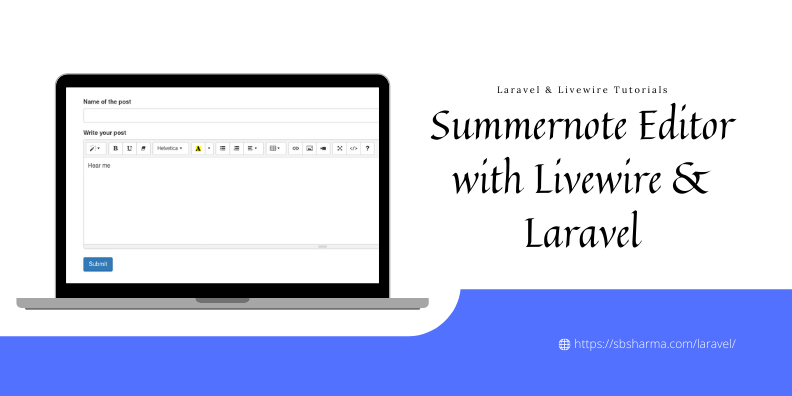
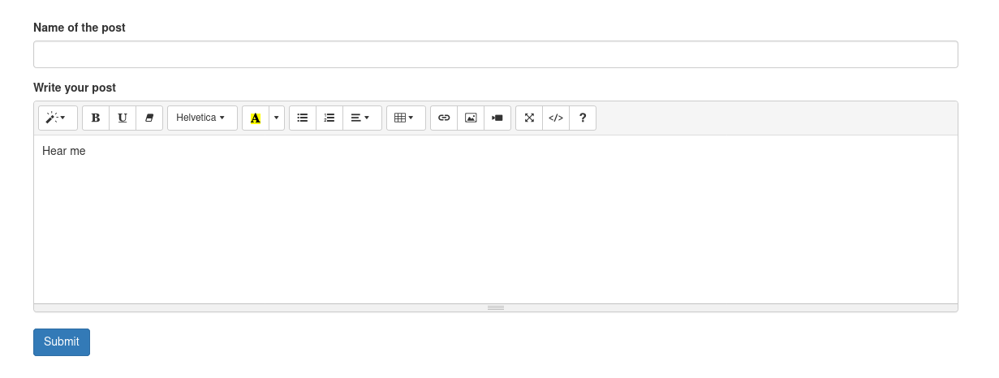

# summernote-livewire-laravel
A simple example to use summernote WYSIWYG editor with Livewire and Laravel 

# Output
 

# Read Blog
[Summernote editor with livewire and laravel](https://sbsharma.com/summernote-editor-livewire-laravel/)

# Contributor
[Satpal Bhardwaj](https://sbsharma.com/laravel/)

# Follow us

